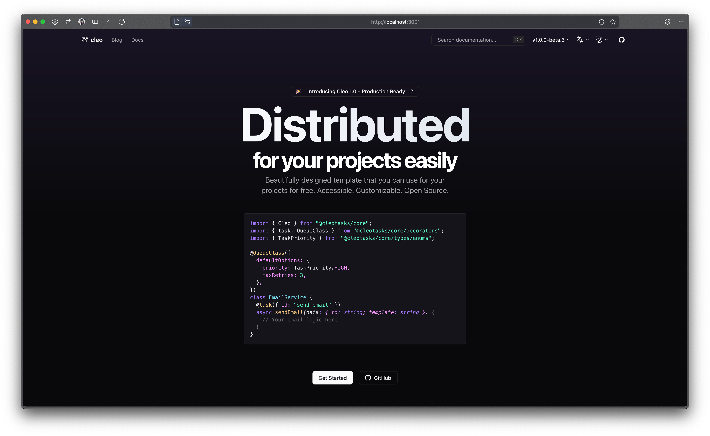

# Cleo - Advanced Task Queue Management System 🚀


Cleo is a powerful, Redis-based distributed task queue management system with advanced group processing capabilities, real-time monitoring, and sophisticated task orchestration.




> **🚧 Under Development:** Cleo is currently in active development. Features and APIs may change. Stay tuned for updates!


> **Note:** We're based on BullMQ, but with some added features and improvements. See the [BullMQ docs](https://docs.bullmq.io/) for more information but we'll cover the main differences here.

## Features 🌟

### Core Features
- 🔄 Distributed task processing with automatic load balancing
- 👥 Advanced group task management with multiple processing strategies
- 📊 Real-time task monitoring and event-driven updates
- 🎯 Priority-based processing with dynamic adjustments
- ⚡ Event-driven architecture using Redis pub/sub
- 🛡️ Built-in error handling with configurable retries
- 📈 Comprehensive task statistics and metrics

### Group Processing Strategies
- 🔄 Round Robin: Fair task distribution across groups for balanced processing
- 📝 FIFO: Sequential processing within groups for ordered execution
- ⭐ Priority: Dynamic priority-based processing with group weights

## System Architecture 🏗️

```mermaid
graph TB
    Client[Client Application] --> Decorator[Task Decorator]
    Decorator --> QM[Queue Manager]
    QM --> Redis[(Redis)]
    QM --> Worker[Worker Pool]
    QM --> Observer[Task Observer]
    QM --> Groups[Task Groups]
    Worker --> Redis
    Observer --> Redis
    Groups --> Redis
    
    subgraph "Event System"
        Observer --> Events((Event Bus))
        Events --> Monitoring[Monitoring System]
        Events --> Logging[Logging System]
        Events --> Metrics[Metrics Collection]
    end

    subgraph "Group Processing"
        Groups --> Strategy{Strategy Manager}
        Strategy --> RR[Round Robin]
        Strategy --> FIFO[FIFO]
        Strategy --> Priority[Priority]
    end

    subgraph "Worker Pool"
        Worker --> W1[Worker 1]
        Worker --> W2[Worker 2]
        Worker --> W3[Worker 3]
    end
```

## Task Processing Flow 🔄

```mermaid
sequenceDiagram
    participant C as Client
    participant D as Decorator
    participant QM as Queue Manager
    participant G as Task Group
    participant W as Worker
    participant R as Redis
    participant O as Observer

    C->>D: Call Method
    D->>QM: Decorate & Submit
    QM->>G: Check Group
    G->>R: Store Group State
    QM->>R: Queue Task
    
    Note over W,R: Continuous Processing
    W->>R: Poll for Tasks
    W->>G: Check Group Order
    G->>R: Verify Next Task
    W->>QM: Process Task
    QM->>O: Emit Events
    O->>R: Update Status
    O->>C: Notify Completion
```

## Real-World Use Cases 🌍

### Video Processing Pipeline 🎥
```mermaid
graph TB
    Upload[Upload Video] --> Validate[Validate Format]
    Validate --> Split[Split Segments]
    Split --> Parallel
    
    subgraph Parallel[Parallel Processing]
        Transcode[Transcode Video]
        Audio[Process Audio]
        Thumbnail[Generate Thumbnails]
    end
    
    Parallel --> Merge[Merge Streams]
    Merge --> Optimize[Optimize Output]
    Optimize --> CDN[Push to CDN]
    
    subgraph "Group: Video Pipeline"
        direction TB
        Validate
        Split
        Parallel
        Merge
        Optimize
        CDN
    end
```

### E-commerce Order Processing 🛍️
```mermaid
graph TB
    Order[New Order] --> Validate[Validate Order]
    Validate --> Stock[Check Stock]
    Stock --> Payment[Process Payment]
    
    Payment --> Parallel
    
    subgraph Parallel[Parallel Processing]
        Invoice[Generate Invoice]
        Label[Create Shipping Label]
        Email[Send Email]
        SMS[Send SMS]
    end
    
    Parallel --> Warehouse[Warehouse Notification]
    Warehouse --> Track[Initialize Tracking]
    
    subgraph "Group: Order Processing"
        direction TB
        Validate
        Stock
        Payment
        Parallel
        Warehouse
        Track
    end
```

### AI Training Pipeline 🤖
```mermaid
graph TB
    Data[Data Collection] --> Clean[Data Cleaning]
    Clean --> Feature[Feature Engineering]
    Feature --> Split[Train/Test Split]
    
    Split --> Training
    
    subgraph Training[Training Pipeline]
        Model[Train Model]
        Validate[Cross Validation]
        Tune[Hyperparameter Tuning]
    end
    
    Training --> Evaluate[Model Evaluation]
    Evaluate --> Deploy[Model Deployment]
    
    subgraph "Group: ML Pipeline"
        direction TB
        Clean
        Feature
        Split
        Training
        Evaluate
        Deploy
    end
```

## Advanced Features 🔧

### Task Grouping Capabilities
- 🔄 **Dynamic Group Creation**
  - Auto-scaling groups
  - Group merging and splitting
  - Dynamic priority adjustment

- 📊 **Group Statistics**
  - Real-time metrics
  - Performance analytics
  - Resource utilization

- 🎯 **Processing Strategies**
  - Adaptive batch processing
  - Smart task routing
  - Load-based scaling

### Event System Architecture 🎯

```mermaid
graph TB
    Task[Task Execution] --> Events{Event Bus}
    
    Events --> Status[Status Updates]
    Events --> Progress[Progress Events]
    Events --> System[System Events]
    
    subgraph "Status Events"
        Status --> Created[Task Created]
        Status --> Started[Task Started]
        Status --> Completed[Task Completed]
        Status --> Failed[Task Failed]
    end
    
    subgraph "Progress Events"
        Progress --> Percent[Percentage Update]
        Progress --> Stage[Stage Complete]
        Progress --> Milestone[Milestone Reached]
    end
    
    subgraph "System Events"
        System --> Worker[Worker Status]
        System --> Queue[Queue Metrics]
        System --> Resource[Resource Usage]
    end
```

## Performance Optimizations ⚡

### Redis Integration
- 📊 Efficient data structures for task storage
- 🔄 Pub/Sub for real-time event propagation
- 💾 Atomic operations for data consistency
- 🔍 Smart caching strategies

### Worker Management
- 🔄 Dynamic worker scaling
- 📈 Intelligent load balancing
- 🚦 Adaptive rate limiting
- 🎯 Resource-aware task distribution

### Group Processing
- 🎯 Predictive task batching
- 📊 Dynamic priority adjustment
- 🔄 Efficient task ordering
- ⚡ Pipeline optimization

## Security Features 🔒

### Authentication & Authorization
- 🔐 Redis ACL support
- 🛡️ Task-level permissions
- 📝 Audit logging
- 🔑 Role-based access control

### Data Protection
- 🔒 Encryption at rest
- 🔐 Secure task data handling
- 🛡️ Input validation
- 📝 Data sanitization

## Monitoring & Debugging 🔍

### Real-time Metrics
- 📊 Task success/failure rates
- ⏱️ Processing time analytics
- 🎯 Group performance metrics
- 📈 Resource utilization stats

### Logging System
- 📝 Structured logging
- 🚨 Error tracking
- 📊 Performance profiling
- 🔍 Debug information

## Installation & Setup 🛠️

[Installation instructions here]

## License 📄

MIT License - see LICENSE file for details
```